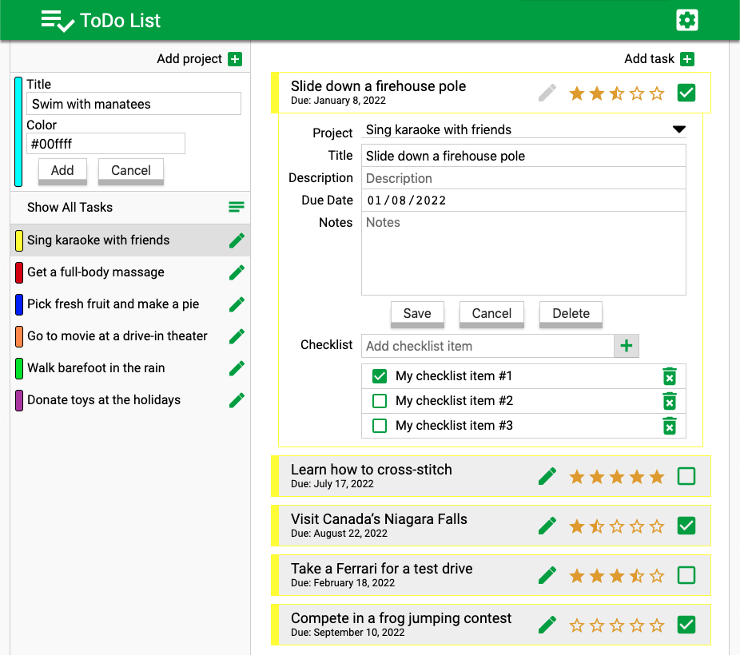

# Project: ToDo List

No developers journey is complete without going through the process of making a todo list app.
Its sort of a rite of passage. This has been my most challenging project yet and with great challenges, come great rewards.
I've learned the most about program organization, keeping things S.O.L.I.D., the importance of testing and having a well thought out design before putting down any code.

### [View ToDo List in browser](https://winplam.github.io/todolist/)

## Notable Outcomes
* One challenge of doing this project was saving objects to localStorage which can only handle string key/value pairs.
This means methods get lost along the way so they need to be converted first.
After not finding any satisfactory way of saving both strings data and methods at the same time,
I decided to combine the powers of Object.assign, spread syntax, and JSON.stringify into one function to save both string data and methods into localStorage.
`const savedData = Object.assign({}, { ...Project }, JSON.parse(JSON.stringify(Project)))`

* Creating the data structure to save projects was fairly straightforward.
However projects contain tasks and tasks contain checklist.
This nesting of elements exponentially increased the complexity of the application.
I found that starting with the data structure and then developing the application around the data was a strategy that helped to keep the code clean and organized.

## Screenshot

## Technologies Used
This app was created with JavaScript ES6, HTML 5, CSS 3, SASS, WebPack and WebStorm.